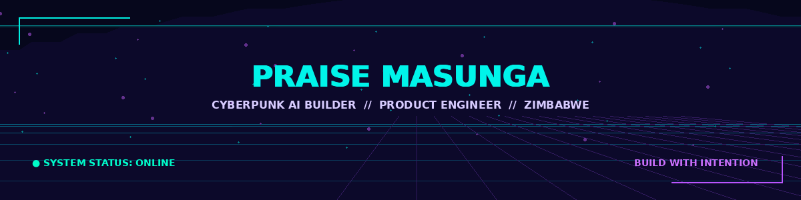

 

 

  

<code>PROFILE NODE // ONLINE</code> &nbsp; <code>CHINHOYI, ZIMBABWE</code> &nbsp; <code>OPEN TO COLLABORATION</code>

  

---

## `01 / PROFILE`

I am **Praise Masunga**, a product-minded software engineer and founder building practical web, mobile, and AI products for real users. My work sits at the intersection of **product thinking, interface design, full-stack engineering, developer tooling, and reliable delivery**.

I build for environments where software has to be more than impressive in a demo. It should be understandable, useful, resilient, and grounded in the needs of the people who depend on it.

> **Build principle:** start with the user problem, reduce unnecessary complexity, and leave behind systems that the next builder can confidently maintain.

## `02 / ACTIVE SYSTEMS`

| System | What it does | Stack | Access |
|---|---|---|---|
| **VENCURE-H** | Snake-safety and risk-intelligence platform designed around calm response, prevention, healthcare support, and structured community reporting. | Expo · React Native · TypeScript · Express · Supabase | `PRIVATE BUILD` |
| **Autopilot CLI** | Local Git automation for safe change batching, conventional commits, protected-branch checks, secret-pattern detection, and normal Git pushes. | Node.js · TypeScript · CLI · Git · AI | `PRIVATE BUILD` |
| [**Lunavo**](https://github.com/PraiseTechzw/Lunavo) | Student-wellness ecosystem for peer support, mood check-ins, anonymous community engagement, and crisis-resource access. | React Native · Expo · Supabase · PostgreSQL | `PUBLIC` |
| [**Nestiq**](https://github.com/PraiseTechzw/nestiq) | Flutter application helping university students discover accommodation near campus. | Flutter · Dart · Mobile product design | `PUBLIC` |
| [**Climate Space Zimbabwe**](https://github.com/PraiseTechzw/climate-space-zimbabwe-web) | Localized climate-resilience platform for Zimbabwean farmers and youth. | Next.js · TypeScript · Tailwind CSS · Vercel | `PUBLIC` |
| [**Taste of Zimbabwe**](https://github.com/PraiseTechzw/recipe) | Culinary application for discovering, preserving, and sharing Zimbabwean cuisine. | React Native · Expo · Supabase · AI | `PUBLIC` |

## `03 / CAPABILITY MATRIX`

| Layer | Technologies and strengths |
|---|---|
| **Product engineering** | React, React Native, Expo, Flutter, Next.js, TypeScript, Kotlin, Jetpack Compose |
| **Backend and data** | Node.js, Express, FastAPI, Django, Laravel, PostgreSQL, Supabase, Drizzle, Prisma, SQLite |
| **Delivery and operations** | Docker, GitHub Actions, Firebase, Vercel, AWS, Google Cloud, Azure |
| **Engineering interests** | Developer tools, practical AI, mobile systems, data design, product UX, reliability, and local-first technology |

## `04 / BUILD PHILOSOPHY`

**User-first decisions.** Understand the problem before choosing the stack.

**Clear product design.** Treat usability, accessibility, and information architecture as engineering concerns.

**Responsible AI.** Use AI where it creates practical value, with clear boundaries and human oversight.

**Reliable systems.** Validate inputs, protect data, test important paths, and document decisions.

**Useful handoff.** Organize projects so another builder can understand, run, and extend them.

## `05 / SIGNAL FEED`

 

 

## `06 / CURRENT OBJECTIVES`

- Growing Autopilot into a developer tool teams can confidently adopt.
- Building practical products for education, safety, wellness, climate resilience, and local communities.
- Completing my BSc in Information Technology at Chinhoyi University of Technology.
- Collaborating with ambitious product teams, founders, clients, and mission-driven builders.

## `07 / OPEN CHANNEL`

I am open to **product engineering, freelance and consulting engagements, open-source collaboration, technical partnerships, and mission-driven teams**.

If you are building something useful and need someone who can move between product strategy, interface design, mobile, backend systems, AI, and delivery, I would be glad to connect.

<a href="https://praisetech.tech"><strong>VISIT PORTFOLIO</strong></a> ·
<a href="https://www.linkedin.com/in/praisemasunga/"><strong>CONNECT ON LINKEDIN</strong></a> ·
<a href="mailto:praisetechzw@gmail.com"><strong>SEND EMAIL</strong></a>

  

BUILDING WITH INTENTION FROM ZIMBABWE FOR AFRICA AND THE WORLD.

